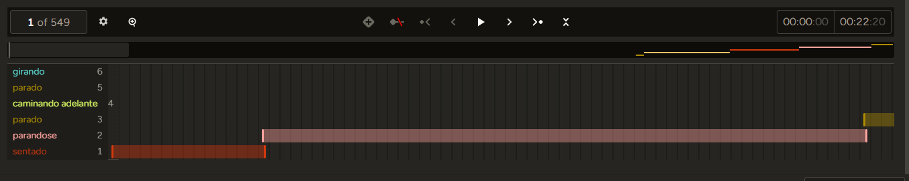

# Primer Conjunto de Entregables (Semana 12)
## Asignatura: Algoritmos y Programación III (APO3)
### Universidad ICESI, Semestre: 2025-2

**Grupo No.3** 

**Integrantes:** `Sebastian Erazo Ochoa | A00400086`
`Gabriel Ernesto Escobar Bravo | A00399291`
`Rony Farid Ordoñez García | A00397968`
<!-- **Enlace al Repositorio (GitHub):** `<URL del Repositorio>` -->

---

## 1. Contexto, Problema de Interés y Tipo de Problema

### Contexto
El proyecto aborda el desarrollo de un **Sistema de Anotación de Video en Tiempo Real** para la **analítica de patrones motores** sutiles, críticos para el seguimiento objetivo de la progresión de **enfermedades neurodegenerativas** (ej., Parkinson). Se busca un método no invasivo para analizar las 5 actividades focales (caminar hacia/de regreso, girar, sentarse, ponerse de pie).

### Pregunta(s) de Interés
1.  **Clasificación:** ¿Podemos clasificar las 5 actividades motrices con alta precisión (*F1-Score* > 0.85) utilizando modelos supervisados (SVM/Random Forest) y características cinemáticas 2D (ángulos, velocidad, inclinación) derivadas de **MediaPipe**? 
2.  **Analítica:** ¿Qué **características biomecánicas** (e.g., velocidad angular de la rodilla, inclinación del tronco) demuestran ser los predictores más importantes para diferenciar las 5 actividades en el contexto de cambios neuromotores? 

### Tipo de Problema
El núcleo es un problema de **Clasificación Multiclase Supervisada** (Activity Recognition).

---

## 2. Metodología y Métricas

### Metodología de Trabajo: CRISP-DM
Se seguirá la metodología CRISP-DM (Cross-Industry Standard Process for Data Mining) en su totalidad, la cual consta de 6 fases iterativas:

| Fase | Tareas Principales para el Primer Entregable |
| :--- | :--- |
| **1. Comprensión del Negocio** | Definición de las 5 clases de actividad y articulaciones clave. Establecimiento de objetivos del proyecto y criterios de éxito. |
| **2. Comprensión de los Datos** | Diseño del protocolo de captura de video (perspectivas, velocidad). Recolección inicial de datos y análisis exploratorio. |
| **3. Preparación de los Datos** | Selección de herramientas de anotación (LabelStudio/CVAT). Plan de Normalización y Filtrado de *landmarks*. Limpieza y transformación de datos. |
| **4. Modelado** | Selección de algoritmos de clasificación (SVM, Random Forest, XGBoost). Diseño de características cinemáticas. Entrenamiento y validación de modelos. |
| **5. Evaluación** | Validación de modelos con métricas de clasificación (Precision, Recall, F1-Score). Análisis de importancia de características. Verificación del cumplimiento de objetivos. |
| **6. Despliegue** | Integración del sistema de anotación en tiempo real. Documentación técnica y plan de mantenimiento. Consideraciones para uso en contexto clínico/investigación. |

### Métricas de Desempeño
Para medir el progreso y el resultado final, se usarán las métricas de clasificación:
* **Precisión (*Precision*)**
* **Exhaustividad (*Recall*)**
* **Puntuación F1 (*F1-Score*)**  (Prioridad para balancear falsos positivos y falsos negativos, crítico en el contexto de seguimiento clínico).

---

## 3. Datos Recolectados y EDA Inicial

### Datos Recolectados Iniciales
* **Recolección:** Videos capturados por cámara web/móvil.
* **Volumen Inicial:** `<Indicar número>`videos; `<Número de personas>` personas; `<Número de repeticiones>` repeticiones por actividad.
* **Herramientas:** Uso de **MediaPipe** para extracción de *landmarks* (Cadera, rodillas, tobillos, muñecas, hombros, cabeza).
* **Anotación:** Etiquetado manual de inicio/fin de cada segmento de actividad clave mediante LabelStudio/CVAT.

### Análisis Exploratorio de Datos (EDA)
1.  **Visualización de Trayectorias:** Gráfico de dispersión de las coordenadas $(x, y)$ de una articulación (ej., rodilla) a lo largo del tiempo para una sola repetición de cada actividad, para visualizar el patrón de movimiento.
2.  **Identificación de Ruido:** Análisis de la varianza en la señal de las coordenadas $(x, y)$ para confirmar la necesidad de **filtrado suave**.
3.  **Inspección de Normalización:** Visualización de las coordenadas antes y después de la estandarización para verificar la independencia del sujeto/distancia.

## 3.1. Guía para Agregar Labels a los Videos con Label Studio

Para realizar el proceso de etiquetado de las actividades motoras, utilizamos la herramienta Label Studio, que permite definir etiquetas personalizadas y asignarlas a segmentos específicos dentro de los videos. A continuación se describe paso a paso cómo se configuró y empleó esta herramienta.

Primero, instalamos Label Studio dentro del entorno virtual del proyecto. Para ello, activamos el entorno (.venv) desde PowerShell y ejecutamos el comando `pip install label-studio`.
Una vez instalado, iniciamos la aplicación con `label-studio start`, lo que abre una interfaz web en la dirección http://localhost:8080
.

Después, creamos un nuevo proyecto en la interfaz de Label Studio. Le asignamos un nombre descriptivo —por ejemplo, Anotación de Actividades Motoras— y seleccionamos el tipo de tarea correspondiente a video. En el apartado de configuración de etiquetado (Labeling Setup), abrimos la opción “Code View” para editar directamente la plantilla y reemplazamos su contenido por el siguiente fragmento, que define las etiquetas necesarias para el proyecto:
```xml
<View>
  <TimelineLabels name="videoLabels" toName="video">
    <Label value="sentado" background="#D4380D"/>
    <Label value="sentandose" background="#FFC069"/>
    <Label value="parado" background="#AD8B00"/>
    <Label value="caminando adelante" background="#D3F261"/>
    <Label value="caminado atras" background="#389E0D"/>
    <Label value="girando" background="#5CDBD3"/>
    <Label value="parandose" background="#FFA39E"/>
  </TimelineLabels>
  <Video name="video" value="$video" timelineHeight="120"/>
</View>
```


Con esta configuración guardada, procedimos a importar los videos a través de la pestaña Tasks → Import, cargando los archivos de video en formato .mp4, .mov o .avi.
Cada video se agregó como una tarea independiente lista para ser anotada.

Durante el proceso de etiquetado, reproducimos cada video dentro de Label Studio y usamos la línea de tiempo inferior para marcar los intervalos de inicio y fin de cada actividad. A cada segmento le asignamos una de las etiquetas definidas anteriormente: sentado, sentándose, parado, caminando adelante, caminando atrás, girando o parándose.
Esta etapa fue clave para delimitar con precisión los momentos donde ocurren los cambios posturales o de movimiento. Para lograr mayor exactitud, aprovechamos las herramientas de zoom y navegación cuadro a cuadro que ofrece la interfaz.



Finalmente, una vez completadas las anotaciones de todos los videos, exportamos los resultados en formato JSON desde la pestaña Export del proyecto.
Este archivo contiene las marcas de tiempo y las etiquetas asociadas a cada actividad, y servirá posteriormente como insumo para el procesamiento con MediaPipe y el análisis de características cinemáticas en la siguiente fase del proyecto.

---

## 4. Estrategias para Aumentar Datos y Siguientes Pasos

### Estrategias de Obtención Adicional de Datos
1.  **Diversificación de Muestra:** Capturar videos de más sujetos y en diferentes entornos/condiciones de iluminación.
2.  **Variación Controlada:** Incluir variaciones en la velocidad de ejecución y pequeñas perturbaciones en el equilibrio para simular condiciones reales.
3.  **Aumento Sintético:** Aplicar *Data Augmentation* a las series temporales de coordenadas articulares (e.g., agregar ruido gaussiano mínimo, reescalado de tiempo).

### Siguientes Pasos (Planificación)
| Semana | Enfoque |
| :--- | :--- |
| **13** | Desarrollo de `pose_estimation.py` y `data_pipeline.py`. Extracción de todas las características (velocidad, ángulos, inclinación). |
| **14** | Entrenamiento inicial de modelos (SVM, RF, XGBoost) y **ajuste de hiperparámetros**. (Corresponde a la Segunda Entrega). |

---

## 5. Análisis de Aspectos Éticos

El contexto de monitoreo de salud exige rigor ético.

* **Privacidad de Datos (GDPR/HIPAA):** Se requiere la **anonimización** total. Se almacenarán únicamente las coordenadas articulares *procesadas* y no los videos originales. El repositorio **no contendrá videos**.
* **Sesgo y Equidad:** El sistema debe validarse contra sesgos de vestimenta o complexión física, lo que podría afectar la detección de *landmarks* por MediaPipe. Se buscará diversidad en la muestra recolectada.
* **Uso Responsable:** Se establecerá claramente que el sistema es para **investigación y monitoreo objetivo**, y **no para el diagnóstico médico definitivo**.

---
*Fin del Informe del Primer Entregable.*
