# Primer Conjunto de Entregables (Semana 12)
## Asignatura: Algoritmos y Programación III (APO3)
### Universidad ICESI, Semestre: 2025-2

**Grupo No.3** 

**Integrantes:** `Sebastian Erazo Ochoa | A00400086`
`Gabriel Ernesto Escobar Bravo | A00399291`
`Rony Farid Ordoñez García | A00397968`
<!-- **Enlace al Repositorio (GitHub):** `<URL del Repositorio>` -->

---

## 1. Contexto, Problema de Interés y Tipo de Problema

### Contexto
El proyecto aborda el desarrollo de un **Sistema de Anotación de Video en Tiempo Real** para la **analítica de patrones motores** sutiles, críticos para el seguimiento objetivo de la progresión de **enfermedades neurodegenerativas** (ej., Parkinson). Se busca un método no invasivo para analizar las 5 actividades focales (caminar hacia/de regreso, girar, sentarse, ponerse de pie).

### Pregunta(s) de Interés
1.  **Clasificación:** ¿Podemos clasificar las 5 actividades motrices con alta precisión (*F1-Score* > 0.85) utilizando modelos supervisados (SVM/Random Forest) y características cinemáticas 2D (ángulos, velocidad, inclinación) derivadas de **MediaPipe**? 
2.  **Analítica:** ¿Qué **características biomecánicas** (e.g., velocidad angular de la rodilla, inclinación del tronco) demuestran ser los predictores más importantes para diferenciar las 5 actividades en el contexto de cambios neuromotores? 

### Tipo de Problema
El núcleo es un problema de **Clasificación Multiclase Supervisada** (Activity Recognition).

---

## 2. Metodología y Métricas

### Metodología de Trabajo: CRISP-DM Adaptada
Se seguirá la metodología CRISP-DM, enfocada en la robustez de los datos.

#### Diagrama de Arquitectura del Sistema

A continuación se presenta el flujo general del sistema propuesto para la anotación y clasificación de actividades motoras usando MediaPipe y modelos de ML supervisados:

Este diagrama resume las etapas principales desde la captura hasta la visualización de resultados.

| Fase | Tareas Principales para el Primer Entregable |
| :--- | :--- |
| **Comprensión del Negocio** | Definición de las 5 clases de actividad y articulaciones clave. |
| **Comprensión de los Datos** | Diseño del protocolo de captura de video (perspectivas, velocidad). |
| **Preparación de los Datos** | Selección de herramientas de anotación (LabelStudio/CVAT). Plan de Normalización y Filtrado de *landmarks*. |

### Métricas de Desempeño
Para medir el progreso y el resultado final, se usarán las métricas de clasificación:
* **Precisión (*Precision*)**
* **Exhaustividad (*Recall*)**
* **Puntuación F1 (*F1-Score*)**  (Prioridad para balancear falsos positivos y falsos negativos, crítico en el contexto de seguimiento clínico).

---

## 3. Datos Recolectados y EDA Inicial

### Datos Recolectados Iniciales
* **Recolección:** Videos capturados por cámara web/móvil.
* **Volumen Inicial:** `<Indicar número>` videos; `<Número de personas>` personas; `<Número de repeticiones>` repeticiones por actividad.
* **Herramientas:** Uso de **MediaPipe** para extracción de *landmarks* (Cadera, rodillas, tobillos, muñecas, hombros, cabeza).
* **Anotación:** Etiquetado manual de inicio/fin de cada segmento de actividad clave mediante LabelStudio/CVAT.

### Análisis Exploratorio de Datos (EDA)
1.  **Visualización de Trayectorias:** Gráfico de dispersión de las coordenadas $(x, y)$ de una articulación (ej., rodilla) a lo largo del tiempo para una sola repetición de cada actividad, para visualizar el patrón de movimiento.
2.  **Identificación de Ruido:** Análisis de la varianza en la señal de las coordenadas $(x, y)$ para confirmar la necesidad de **filtrado suave**.
3.  **Inspección de Normalización:** Visualización de las coordenadas antes y después de la estandarización para verificar la independencia del sujeto/distancia.

---

## 4. Estrategias para Aumentar Datos y Siguientes Pasos

### Estrategias de Obtención Adicional de Datos
1.  **Diversificación de Muestra:** Capturar videos de más sujetos y en diferentes entornos/condiciones de iluminación.
2.  **Variación Controlada:** Incluir variaciones en la velocidad de ejecución y pequeñas perturbaciones en el equilibrio para simular condiciones reales.
3.  **Aumento Sintético:** Aplicar *Data Augmentation* a las series temporales de coordenadas articulares (e.g., agregar ruido gaussiano mínimo, reescalado de tiempo).

### Siguientes Pasos (Planificación)
| Semana | Enfoque |
| :--- | :--- |
| **13** | Desarrollo de `pose_estimation.py` y `data_pipeline.py`. Extracción de todas las características (velocidad, ángulos, inclinación). |
| **14** | Entrenamiento inicial de modelos (SVM, RF, XGBoost) y **ajuste de hiperparámetros**. (Corresponde a la Segunda Entrega). |

---

## 5. Análisis de Aspectos Éticos

El contexto de monitoreo de salud exige rigor ético.

* **Privacidad de Datos (GDPR/HIPAA):** Se requiere la **anonimización** total. Se almacenarán únicamente las coordenadas articulares *procesadas* y no los videos originales. El repositorio **no contendrá videos**.
* **Sesgo y Equidad:** El sistema debe validarse contra sesgos de vestimenta o complexión física, lo que podría afectar la detección de *landmarks* por MediaPipe. Se buscará diversidad en la muestra recolectada.
* **Uso Responsable:** Se establecerá claramente que el sistema es para **investigación y monitoreo objetivo**, y **no para el diagnóstico médico definitivo**.

---
*Fin del Informe del Primer Entregable.*
