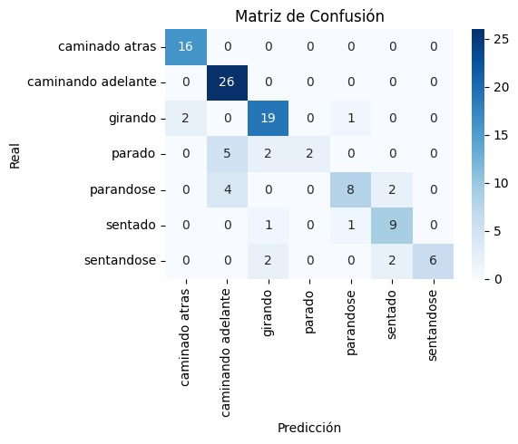
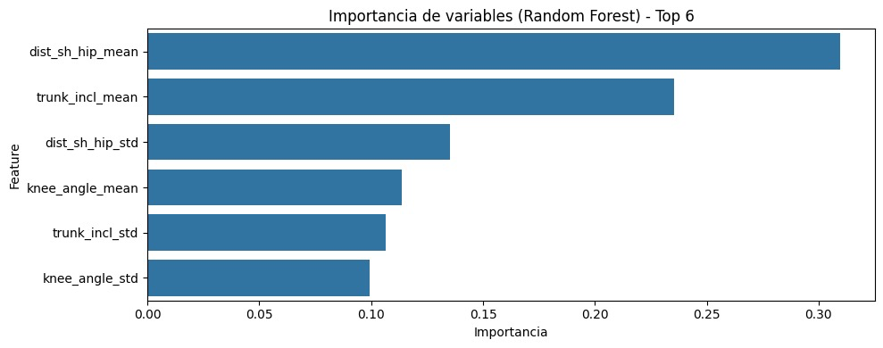

# Segundo Conjunto de Entregables (Semana 14)
## Asignatura: Algoritmos y Programación III (APO3)
### Universidad ICESI, Semestre: 2025-2

**Grupo No.3** 

**Integrantes:** 

`Sebastian Erazo Ochoa | A00400086`

`Gabriel Ernesto Escobar Bravo | A00399291`

`Rony Farid Ordoñez García | A00397968`

---

## 1. Estrategia para la obtención de nuevos datos

Con el propósito de ampliar el conjunto de datos y mejorar la capacidad generalización del modelo, se implementó una estrategia colaborativa de recolección adicional. Para ello, se solicitó la participación de más compañeros del curso, quienes grabaron nuevos videos siguiendo exactamente la misma secuencia de acciones establecida en el conjunto original: el participante inicia sentado, se pone de pie, camina hacia adelante, gira, camina hacia atrás, gira nuevamente y se sienta.

La mayoría de las grabaciones se realizaron en el mismo entorno físico, garantizando consistencia en las condiciones de captura (fondo, iluminación y ángulo de cámara). Sin embargo, se introdujo variabilidad natural en aspectos como la vestimenta, el ritmo de desplazamiento y la forma de caminar de cada participante. Esta variación aporta diversidad al conjunto y favorece que el modelo aprenda a reconocer los patrones de movimiento de manera más robusta, sin depender de características específicas de una sola persona o grabación.

Como resultado de esta estrategia, se logró duplicar la cantidad total de datos disponibles respecto al conjunto inicial.

---

## 2. Preparación de nuevos datos
Una vez obtenidos los nuevos videos, se aplicó el mismo flujo de preparación y procesamiento utilizado en la primera fase del proyecto, con el fin de mantener la coherencia metodológica y asegurar la compatibilidad entre los conjuntos de datos originales y ampliados.

## 2.1. Procesamiento inicial y etiquetado

Todos los videos recolectados fueron sometidos al proceso de anotación manual utilizando la herramienta Label Studio, siguiendo la misma configuración de etiquetas establecida previamente: sentado, sentándose, parado, caminando adelante, caminando atrás, girando y parándose.

```xml
<View>
  <TimelineLabels name="videoLabels" toName="video">
    <Label value="sentado" background="#D4380D"/>
    <Label value="sentandose" background="#FFC069"/>
    <Label value="parado" background="#AD8B00"/>
    <Label value="caminando adelante" background="#D3F261"/>
    <Label value="caminado atras" background="#389E0D"/>
    <Label value="girando" background="#5CDBD3"/>
    <Label value="parandose" background="#FFA39E"/>
  </TimelineLabels>
  <Video name="video" value="$video" timelineHeight="120"/>
</View>
```


Para ello, se creó un nuevo proyecto en Label Studio y se importaron los videos en formato .mp4 o .mov. Cada video fue revisado individualmente, marcando los intervalos de inicio y fin de cada actividad mediante la línea de tiempo interactiva. Este proceso permitió segmentar de manera precisa las transiciones entre posturas y movimientos, garantizando la correcta correspondencia entre las etiquetas y las acciones observadas.

Finalizado el etiquetado, las anotaciones se exportaron en formato JSON, conteniendo las marcas de tiempo y las etiquetas asociadas a cada segmento. Este archivo sirvió como insumo para las etapas posteriores de extracción de características.

## 2.2. Extracción de características con MediaPipe

Con base en los videos y las anotaciones obtenidas, se utilizó MediaPipe Pose para la extracción automática de landmarks corporales clave, incluyendo caderas, rodillas, tobillos, muñecas, hombros y cabeza.
El resultado de esta etapa fue un conjunto estructurado de coordenadas (𝑥,𝑦)
y sus correspondientes etiquetas de actividad, lo que permitió transformar los datos crudos (videos) en un formato numérico adecuado para el entrenamiento de modelos de aprendizaje automático.

## 2.3. Normalización y limpieza de datos

Posteriormente, se aplicaron los mismos procedimientos de normalización espacial y temporal implementados en la primera versión del dataset, con el fin de eliminar sesgos relacionados con la distancia a la cámara o la estatura de los participantes.

Se revisaron las trayectorias de las articulaciones en el tiempo, verificando la consistencia de los patrones y detectando posibles puntos ruidosos o inconsistencias generadas por errores de detección del modelo de pose. En los casos necesarios, se aplicó un filtro de suavizado (moving average) para reducir la variabilidad espuria en las coordenadas.

## 2.4. Integración con el conjunto original

Finalmente, los nuevos datos procesados se integraron con el conjunto original, duplicando así el volumen total disponible para entrenamiento. Antes de la integración definitiva, se validó que las etiquetas y el formato de las características coincidieran con los del dataset base, asegurando una estructura uniforme para las etapas posteriores de modelado.

---

## 3. Implementación del modelo

Excelente — con el notebook que compartes se puede dejar la sección **3. Implementación del modelo** mucho más precisa, con una redacción que refleje el pipeline real (desde la carga de features hasta el guardado del modelo) y el objetivo de uso en tiempo real.
Aquí tienes la versión mejorada, lista para tu informe:

---

## 3. Implementación del modelo

El propósito de esta etapa fue desarrollar y entrenar un modelo de clasificación capaz de identificar en tiempo real la acción que realiza una persona frente a la cámara, basándose en las etiquetas definidas durante la fase de anotación (*sentado*, *parado*, *caminando adelante*, *caminando atrás*, *girando*, *sentándose*, *parándose*).

Para ello, se construyó un pipeline de aprendizaje supervisado empleando **Random Forest** como algoritmo base. Este enfoque se seleccionó por su robustez ante ruido, su capacidad para manejar variables no lineales y su buen rendimiento en tareas de clasificación multiclase con características numéricas derivadas de secuencias corporales.

---

### 3.1. Estructura del conjunto de características

El modelo se entrenó sobre un dataset tabular generado a partir de los videos procesados con **MediaPipe Pose**, en el que cada muestra representa un segmento de video correspondiente a una actividad etiquetada.

Cada registro contiene estadísticas descriptivas de movimiento, calculadas a partir de los *landmarks* detectados:

* **Ángulo de rodilla:** promedio y desviación estándar (`knee_angle_mean`, `knee_angle_std`)
* **Inclinación del tronco:** promedio y desviación estándar (`trunk_incl_mean`, `trunk_incl_std`)
* **Distancia hombro–cadera:** promedio y desviación estándar (`dist_sh_hip_mean`, `dist_sh_hip_std`)

En total, el conjunto final contiene **1453 muestras** y **6 variables numéricas** por instancia, además de las columnas de metadatos (`video`, `start_frame`, `end_frame`, `actividad`).

Ejemplo de estructura del dataset:

| video       | start_frame | end_frame | knee_angle_mean | trunk_incl_mean | dist_sh_hip_mean | actividad |
| ----------- | ----------- | --------- | --------------- | --------------- | ---------------- | --------- |
| Video 1.mp4 | 0           | 14        | 130.6           | 13.4            | 0.0857           | sentado   |
| Video 1.mp4 | 14          | 28        | 139.0           | 16.8            | 0.0758           | parándose |

---

### 3.2. Preprocesamiento

Antes del entrenamiento:

* Se eliminaron valores nulos y columnas no numéricas.
* Las etiquetas se codificaron numéricamente mediante `pandas.Categorical`.
* El dataset se dividió en **80% entrenamiento** y **20% prueba**, manteniendo la proporción de clases (estratificación).

```python
X_train, X_test, y_train, y_test = train_test_split(
    X, y_encoded, test_size=0.2, random_state=42, stratify=y_encoded
)
```

---

### 3.3. Entrenamiento del modelo Random Forest

Se entrenó un clasificador **RandomForestClassifier** con los siguientes parámetros iniciales:

```python
clf = RandomForestClassifier(
    n_estimators=100,
    max_depth=None,
    random_state=42
)
```

El modelo obtuvo una puntuación de:

* **Entrenamiento:** 1.00
* **Prueba:** 0.796

Este comportamiento indica un leve sobreajuste, que será abordado en la siguiente etapa de ajuste de hiperparámetros.

---


### 3.4. Resultados iniciales 

A continuación se presentan los resultados del modelo sobre el conjunto de prueba:

| Clase                  | Precisión | Recall   | F1-Score | Soporte |
| ---------------------- | --------- | -------- | -------- | ------- |
| Caminando atrás        | 0.89      | 1.00     | 0.94     | 16      |
| Caminando adelante     | 0.74      | 1.00     | 0.85     | 26      |
| Girando                | 0.79      | 0.86     | 0.83     | 22      |
| Parado                 | 1.00      | 0.22     | 0.36     | 9       |
| Parándose              | 0.80      | 0.57     | 0.67     | 14      |
| Sentado                | 0.69      | 0.82     | 0.75     | 11      |
| Sentándose             | 1.00      | 0.60     | 0.75     | 10      |
| **Accuracy global**    | —         | —        | **0.80** | **108** |
| **Promedio macro**     | **0.85**  | **0.73** | **0.74** | **108** |
| **Promedio ponderado** | **0.82**  | **0.80** | **0.78** | **108** |



La **matriz de confusión** mostró una correcta separación entre actividades dinámicas (*caminar adelante/atrás, girar*), mientras que las posturas estáticas (*sentado, parado*) presentaron mayor confusión entre sí, debido a su similitud postural y menor variabilidad angular.



El análisis de importancia de variables revela que las características más relevantes para la clasificación son:

Distancia hombro–cadera promedio ```(dist_sh_hip_mean)```,

Inclinación del tronco promedio ```(trunk_incl_mean)```,

y la variabilidad en la distancia hombro–cadera ```(dist_sh_hip_std)```.

Estas variables reflejan relaciones biomecánicas claves, ya que capturan tanto la postura corporal global como los cambios de orientación del torso y desplazamiento, factores determinantes para diferenciar entre actividades de movimiento y posturas estáticas.

En términos generales, el desempeño del modelo es sólido para el reconocimiento de acciones básicas, y las variables más influyentes coinciden con los parámetros esperados desde el punto de vista cinemático. Esto valida el enfoque adoptado y establece una base adecuada para la implementación del sistema de inferencia en tiempo real en la siguiente fase del proyecto.


---

### 3.5. Ajuste de hiperparámetros (Grid Search)

Con el fin de mejorar el desempeño del modelo base de **Random Forest**, se implementó un proceso de búsqueda exhaustiva de hiperparámetros mediante **Grid Search** utilizando validación cruzada estratificada. El objetivo fue identificar la combinación de parámetros que maximizara la métrica **F1-Score macro**, priorizando el equilibrio entre clases en un escenario multiclase.

#### Rango de parámetros evaluados

| Parámetro           | Valores evaluados |
| ------------------- | ----------------- |
| `n_estimators`      | [100, 200, 400]   |
| `max_depth`         | [None, 10, 20]    |
| `max_features`      | ['sqrt', 'log2']  |
| `min_samples_split` | [2, 4, 6]         |
| `min_samples_leaf`  | [1, 2, 3]         |
| `bootstrap`         | [True, False]     |

El proceso se realizó sobre el conjunto de entrenamiento con validación cruzada de 5 pliegues (`cv=5`), empleando como métrica principal el **macro F1-score**, lo que permitió evaluar de manera equilibrada el rendimiento del modelo en cada clase, independientemente del número de muestras por categoría.

#### Mejores hiperparámetros encontrados

```python
{
  'bootstrap': True,
  'max_depth': None,
  'max_features': 'sqrt',
  'min_samples_leaf': 1,
  'min_samples_split': 2,
  'n_estimators': 400
}
```

Estos valores indican que el modelo final utiliza un conjunto más amplio de árboles (400 estimadores), manteniendo una profundidad sin restricción (`max_depth=None`) y un muestreo aleatorio de características en cada división (`max_features='sqrt'`), lo cual favorece la diversidad de los árboles y mejora la capacidad de generalización.

#### Resultados del modelo optimizado

El modelo ajustado alcanzó una **precisión global (accuracy) del 81.5%**, con mejoras visibles en las clases de movimiento dinámico y una ligera reducción del sobreajuste observado en el modelo base.

| Clase                  | Precisión | Recall   | F1-Score  | Soporte |
| ---------------------- | --------- | -------- | --------- | ------- |
| Caminando atrás        | 0.94      | 1.00     | 0.97      | 16      |
| Caminando adelante     | 0.72      | 1.00     | 0.84      | 26      |
| Girando                | 0.83      | 0.91     | 0.87      | 22      |
| Parado                 | 1.00      | 0.22     | 0.36      | 9       |
| Parándose              | 0.80      | 0.57     | 0.67      | 14      |
| Sentado                | 0.77      | 0.91     | 0.83      | 11      |
| Sentándose             | 1.00      | 0.60     | 0.75      | 10      |
| **Accuracy global**    | —         | —        | **0.815** | **108** |
| **Promedio macro**     | **0.87**  | **0.74** | **0.76**  | **108** |
| **Promedio ponderado** | **0.84**  | **0.81** | **0.79**  | **108** |

#### Matriz de confusión del modelo optimizado


La matriz de confusión muestra que el modelo optimizado con los hiperparámetros seleccionados mantiene una **clasificación muy precisa para las actividades dinámicas**, especialmente *caminando adelante* y *caminando atrás*, donde no se observan errores de predicción.

También se observa una **mejor discriminación en la clase *girando*** (20 de 22 instancias correctamente clasificadas), y un incremento en la detección de las clases *sentado* y *parándose* frente al modelo base.

Las principales confusiones se concentran en las posturas **estáticas o de transición** (*parado*, *parándose*, *sentándose*), donde las diferencias cinemáticas son más sutiles.

En conjunto, la matriz confirma que el ajuste de hiperparámetros **redujo los falsos positivos en las actividades dinámicas** y **mejoró la estabilidad del clasificador**, validando la selección del modelo Random Forest optimizado como base del sistema de reconocimiento de acciones en tiempo real.


---

### 3.6. Guardado del modelo y despliegue futuro

El modelo final fue exportado en formato **Joblib** (`random_forest_model.joblib`), junto con su reporte de métricas (`random_forest_metrics.json`).
Estos artefactos podrán integrarse en un script de inferencia conectado a la cámara, de modo que los landmarks obtenidos por **MediaPipe Pose** sean procesados en vivo para predecir la acción que realiza el usuario.

```python
joblib.dump(clf, '../results/random_forest_model.joblib')
```

Esto permitirá su uso posterior en una aplicación de detección de actividad humana en tiempo real, objetivo final del proyecto.


---

## 4. Plan de despliegue


El despliegue del modelo se plantea en un entorno local o de laboratorio con una **cámara en tiempo real** y el uso de **MediaPipe Pose** como extractor de características corporales.

El flujo de inferencia se estructura de la siguiente manera:

1. **Captura de video en tiempo real:**
   Se accede a la cámara mediante OpenCV (`cv2.VideoCapture(0)`).

2. **Extracción de landmarks:**
   MediaPipe Pose detecta los puntos clave del cuerpo (caderas, rodillas, hombros, etc.) y genera sus coordenadas por cuadro.

3. **Cálculo de características:**
   A partir de las coordenadas se calculan las mismas métricas usadas en el entrenamiento (ángulo de rodilla, inclinación de tronco, distancia hombro–cadera, etc.).

4. **Inferencia del modelo:**
   El modelo previamente entrenado y almacenado (`random_forest_model.joblib`) se carga con Joblib y predice en tiempo real la etiqueta de actividad actual.

   ```python
   model = joblib.load('random_forest_model.joblib')
   pred = model.predict([feature_vector])
   ```

5. **Visualización en vivo:**
   La etiqueta predicha se superpone sobre el video en tiempo real, permitiendo observar la acción identificada.

Este esquema permitirá el funcionamiento autónomo del sistema de **reconocimiento de actividades humanas** en tiempo real, manteniendo coherencia con el conjunto de datos y características utilizadas durante el entrenamiento.


---

## 5. Análisis inicial de los impactos de la solución

El desarrollo del sistema de clasificación de actividades motoras en tiempo real tiene implicaciones relevantes tanto en el ámbito tecnológico como en el social y ético.

En primer lugar, desde el punto de vista tecnológico y aplicado, la solución demuestra la viabilidad de un sistema no invasivo capaz de identificar posturas y movimientos humanos utilizando únicamente una cámara convencional y técnicas de visión por computador (MediaPipe) combinadas con aprendizaje automático (Random Forest). Este enfoque podría ser la base para futuras aplicaciones en el monitoreo de la movilidad, la rehabilitación física o el seguimiento de pacientes con trastornos neuromotores (por ejemplo, Parkinson o lesiones músculo-esqueléticas).

En términos de impacto social, el sistema puede contribuir al desarrollo de herramientas de evaluación accesibles, de bajo costo y de fácil implementación en contextos educativos, clínicos o de investigación, promoviendo una mayor autonomía en el análisis de patrones de movimiento y reduciendo la necesidad de equipamiento especializado.

Sin embargo, también se identifican consideraciones éticas y limitaciones. El manejo de datos personales en forma de video implica riesgos de privacidad; por ello, se adoptó la práctica de no almacenar los videos originales, conservando únicamente las coordenadas procesadas de las articulaciones. Además, es importante mitigar posibles sesgos asociados a condiciones de iluminación, vestimenta o morfología corporal, que podrían afectar la precisión del sistema.

En conclusión, el prototipo desarrollado representa un avance significativo hacia la creación de sistemas de analítica motora accesibles, éticamente responsables y técnicamente viables, con potencial de expansión hacia escenarios clínicos y de investigación en futuras fases del proyecto.